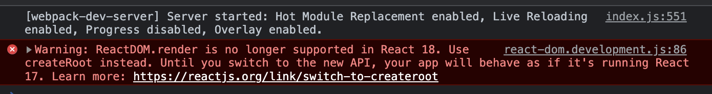

# Lesson 1.1

## Concepts covered

- Intro to React
- Project setup
- Components
- JSX
- List in React

## Observations

### Asides

- Create React App one way to set up React project- many others but this beginner friendly. Another easy option is Vite using the React template
- Installation
  - npx runs scripts over the internet without having to install them locally first
  - npm (Node Package Manager) and npx are installed alongside Node
  - yarn is another package manager that is similar to npm
- typing `yarn run` in an installed project will give you a list of commands that are available in package.json
- Console error can be eliminated by changing from ReactDOM.render to root.render 

### Todo list instructions

- JSX has to be limited to returning single DOM element.
  - the single DOM element can contain any number of sub-elements
  - for now use DIV as that element with the h1 and ul inside it
  - document fragment taught in lesson 1.5

### Todo list end-state

- contains
  - installed CRA
  - heading of h1 type,
  - below that is an unordered list of the items found in the array
- does
  - React renders the h1, ul, then generates all the li's based on the array of todos.
  - No interactivity yet :-(

## Potential concept demo ideas

- JavaScript equivalent of JSX rendering and why the DX is lovely (Think FE Masters)
- Other materials which can be looped over

## End of lesson app capabilities/features
